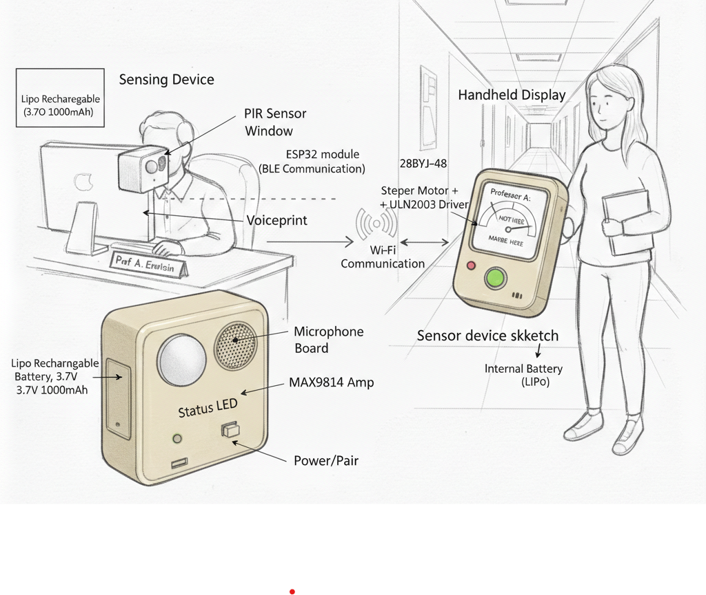
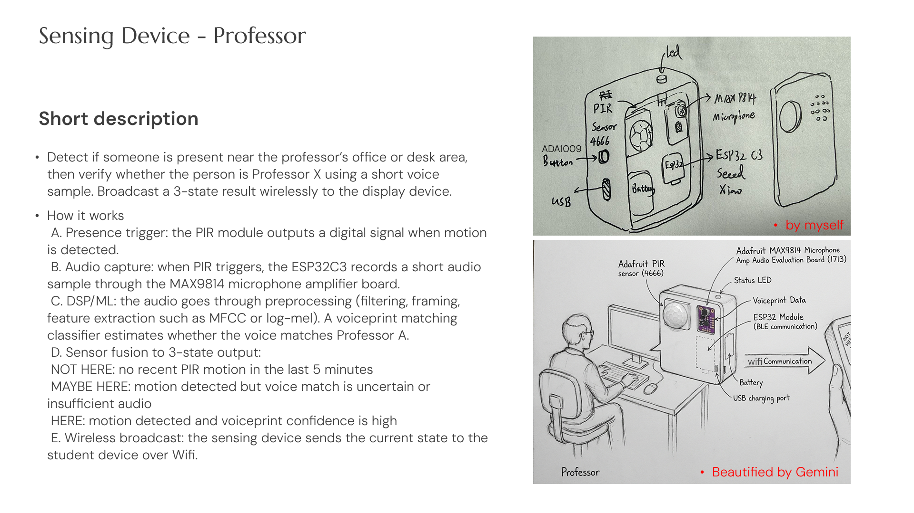
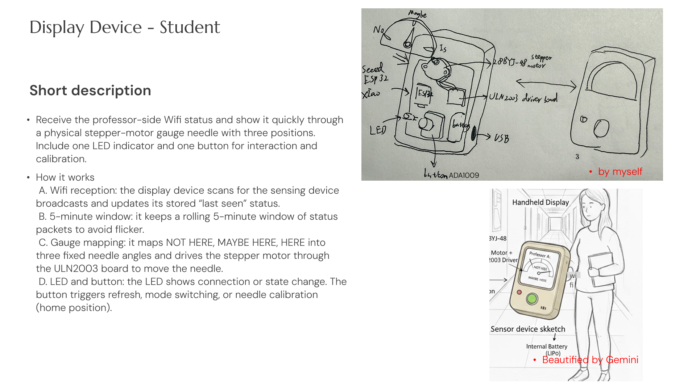
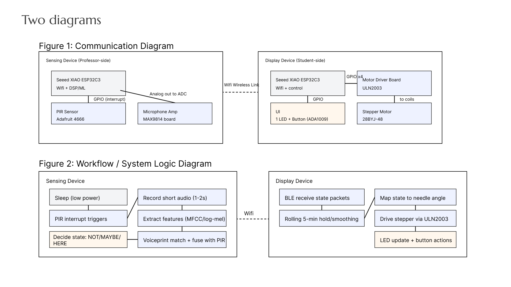

# Where is Professor?

## Title Slide

Where is Professor is a two-device system that helps students know whether Professor A is likely at a specific location (office/desk) within the last 5 minutes. A sensing device stays at the location and detects human motion plus identifies Professor A using voiceprint matching. A handheld display device shows a 3-state gauge: NOT HERE, MAYBE HERE, HERE.

[note: this sketch is beautified by gemini]

---

## Slide 1: Sensing Device (Professor-side)

---

## Slide 2: Display Device (Student-side)

---

## Slide 3: Communication + System Diagram (two figures)

---

## Datasheets

1. ESP32 Module (Seeed XIAO ESP32C3): 
   from class
   https://files.seeedstudio.com/wiki/XIAO/Seeed-Studio-XIAO-Series-SOM-Datasheet.pdf

2. PIR sensor (Adafruit 4666, DigiKey):
    Adafruit module from DigiKey
    https://www.digikey.com/en/products/detail/adafruit-industries-llc/4666/13175534

3. microphone (MAX9814 microphone amp evaluation board):
   Adafruit module from DigiKey
   https://www.digikey.com/en/products/detail/adafruit-industries-llc/1713/4990777?gclsrc=aw.ds&gad_source=1&gad_campaignid=20243136172&gbraid=0AAAAADrbLlifQ3WohBJYpeQPLt0Fqqw0w&gclid=CjwKCAiA7LzLBhAgEiwAjMWzCKGb48V-fHbg-tHP8dPdj8i1tnmkpwBae637Edh4C863_Cud1uMRPhoCOdYQAvD_BwE

4. stepper motor (28BYJ-48): 
   Amazon
    https://www.amazon.com/28BYJ-48-ULN2003-Stepper-Driver-Arduino/dp/B07YRHX73L

5. motor driver board (ULN2003):
   Amazon (as above)

6. Battery (LiPo Rechargeable Battery, 3.7 V 1000 mAh, JST-PH 2.0 connector):
   DigiKey
    https://www.digikey.com/en/products/detail/tinycircuits/ASR00012/9808769?gclsrc=aw.ds&gad_source=1&gad_campaignid=20243136172&gbraid=0AAAAADrbLlifQ3WohBJYpeQPLt0Fqqw0w&gclid=CjwKCAiA7LzLBhAgEiwAjMWzCEJZiL6raQ9E_O6gIfG3adi9dCUatPesKBRWgfPOojsjpn4AEaeL2hoCfmUQAvD_BwE

7. Button (Adafruit Colorful Round Tactile Button Switch Assortment 15 Pack (ADA1009)):
   DigiKey
   https://www.digikey.com/en/products/detail/adafruit-industries-llc/1009/7241401?utm_source=chatgpt.com
